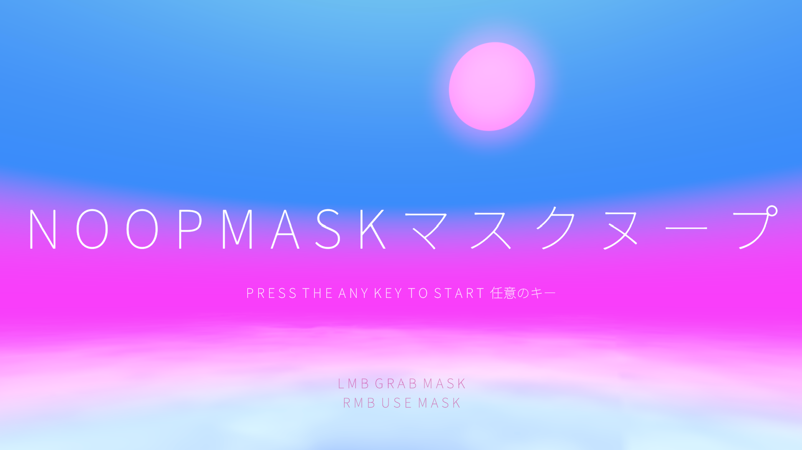
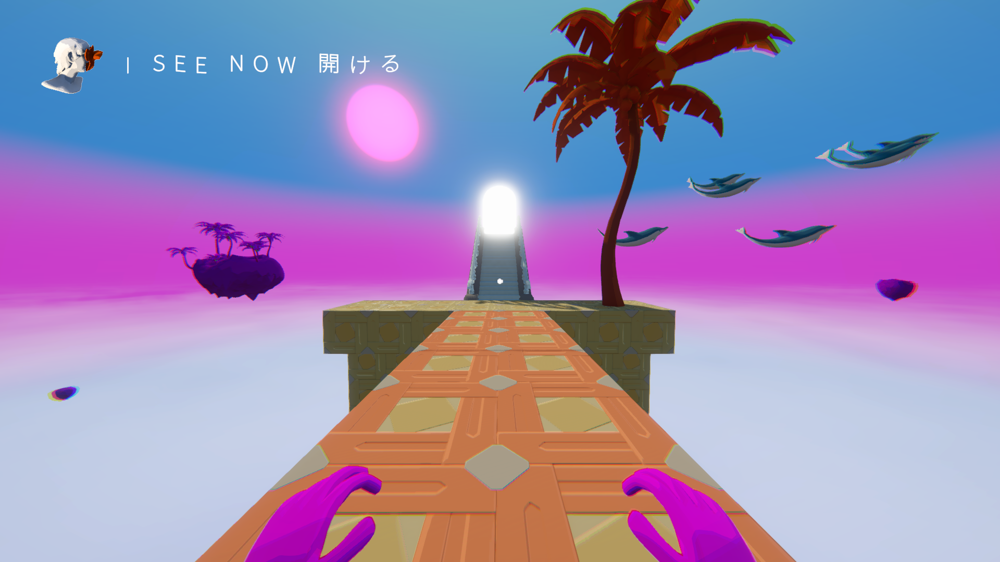
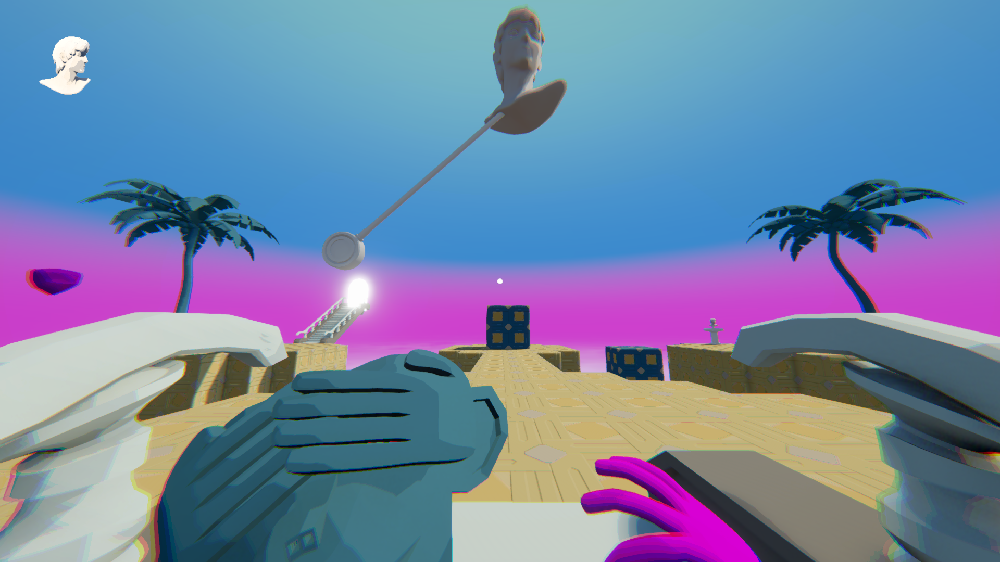

  

WEAR RED 👁️ MASK, REVEAL RED OBJECTS. WEAR BLUE 🙈 MASK, OCCLUDE BLUE OBJECTS.
ASCEND THE STAIRS TO デリート

---

# N O O P M A S K

A vaporwave-inspired puzzle game in which you'll pick up colored masks that affect
similarly colored things, with the effect defined by the shape of each mask.

Move around with WASD and mouse; pick up or drop masks with left-click; wear held masks
with right-click.

Reach the glowing doorway to proceed!

_Created as part of
[Global Game Jam 2026](https://globalgamejam.org/games/2026/layer-cake-mask-9)._

## Installation

1. Download "NOOPMASK.zip" from
   [the releases page](https://github.com/ddabble/NOOPMASK/releases)
1. Unzip the file
1. Run "NOOPMASK.exe"

## Screenshots

 

<video src="https://github.com/user-attachments/assets/a84c716b-0a68-4e12-abab-14a682364cb0">
  Gameplay video showing the main menu and start of level 1
</video>

  <i>
    <a href="img/gameplay.webm">Link to gameplay video if the video player above doesn't work</a>
  </i>

## Credits

Listed in alphabetical order:
* [ddabble](https://github.com/ddabble) - Programming
* [Fueredoriku](https://github.com/Fueredoriku) - Programming, level design,
  3D modelling
* [karofmah](https://github.com/karofmah) - Programming
* [Louissundronning](https://github.com/Louissundronning) - 3D modelling, animation,
  concept art
* [SondreHus](https://github.com/SondreHus) - 3D modelling, level design, programming
* [toberge](https://github.com/toberge) - Programming, music, sound effects

Overall game design contributed to by everyone.
